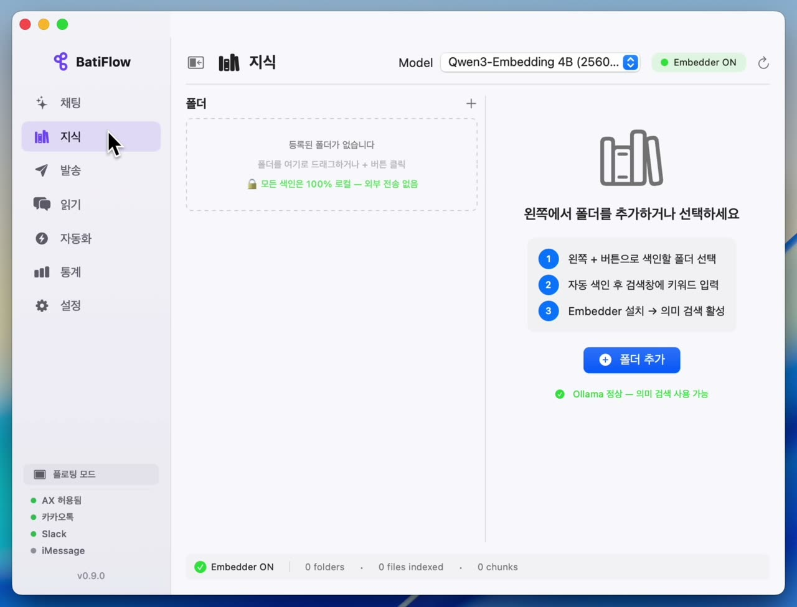
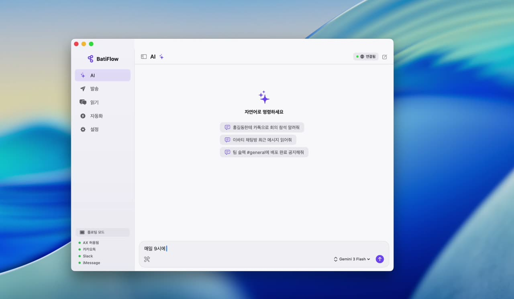
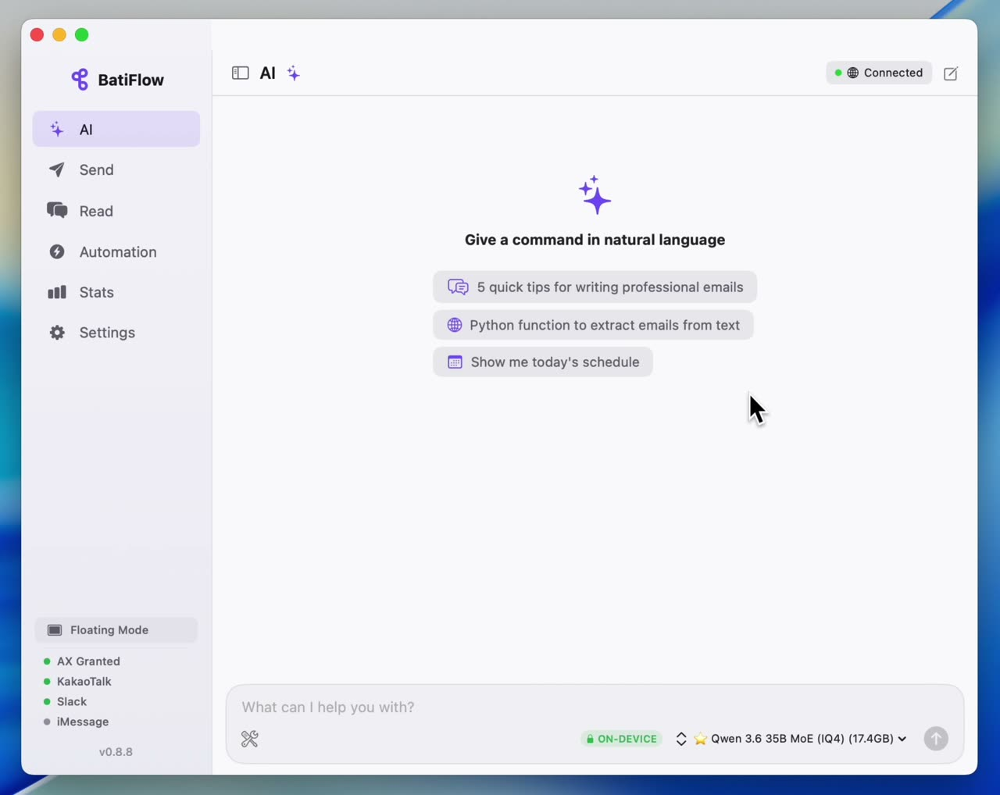
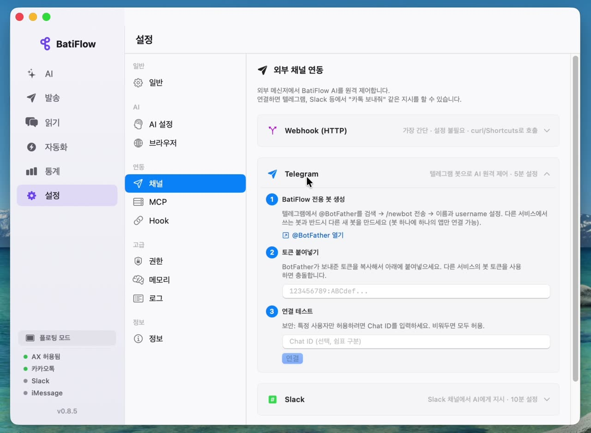

<div align="center">

# BatiFlow

**On-device AI desktop automation + local knowledge for Mac** — free, private, unlimited.

Run open-source AI models locally with a few clicks. No cloud, no API keys, no cost.
Control any macOS app through natural language — even apps without APIs.

**NEW in v0.10:** **Web Scrap** clips LinkedIn / Threads / X / Medium posts to plain markdown — yours forever, no service can take them away. **Knowledge Graph** visualizes how your captures cluster.
**v0.9:** Local RAG search across your folders — filename, body, or meaning. Korean filenames work out of the box.

[](https://github.com/batiai/batiflow-releases/releases/latest)
[](https://github.com/batiai/batiflow-releases/releases/latest)
[](https://bati.ai)

[**Download**](https://github.com/batiai/batiflow-releases/releases/latest) · [Windows? STT 가이드](docs/WINDOWS-STT.md) · [Website](https://flow.bati.ai) · [BatiAI Models](https://huggingface.co/batiai) · [Ollama Library](https://ollama.com/batiai) · [Issues](https://github.com/batiai/batiflow-releases/issues)

</div>

---

## 🎬 See it in action

<table>
  <tr>
    <td width="50%" align="center" valign="top">
      <a href="https://flow.bati.ai/demos/rag-search.mp4" target="_blank">
        
      </a>
      <br>
      <strong>📂 Folder Search · Local RAG</strong> &nbsp; <em>NEW v0.9.0</em>
      <br>
      <sub>Drop a folder. Search by filename, body, or meaning. Korean filenames work out of the box (NFD normalization · whitespace equivalence). 100% on-device.</sub>
    </td>
    <td width="50%" align="center" valign="top">
      <a href="https://flow.bati.ai/demos/kakao-automation.mp4" target="_blank">
        
      </a>
      <br>
      <strong>💬 KakaoTalk Automation</strong>
      <br>
      <sub>"Summarize KakaoTalk every 9am" — read, AI summary, send, schedule. Combine with browser automation: search Google → screenshot → KakaoTalk image.</sub>
    </td>
  </tr>
  <tr>
    <td width="50%" align="center" valign="top">
      <a href="https://flow.bati.ai/demos/on-device-ai.mp4" target="_blank">
        
      </a>
      <br>
      <strong>🤖 On-device AI · macOS native</strong>
      <br>
      <sub>Local AI writes code → saves the result file → opens in Finder → checks schedule → registers a calendar event. Native macOS tools controlled by natural language.</sub>
    </td>
    <td width="50%" align="center" valign="top">
      <a href="https://flow.bati.ai/demos/telegram-bridge.mp4" target="_blank">
        
      </a>
      <br>
      <strong>📡 External Channels · Telegram Bridge</strong>
      <br>
      <sub>Call your Mac's local AI from anywhere via Telegram Bot in a few clicks. Execution logs auto-synced. Discord and Webhooks supported too.</sub>
    </td>
  </tr>
</table>

<sub>👉 Click any thumbnail to play the MP4. All four workflows run 100% on your Mac — no cloud, no account.</sub>

---

## Why BatiFlow?

| | BatiFlow | ChatGPT / Claude | Zapier / Make / n8n | Spotlight |
|--|---------|-----------------|---------------------|---------|
| **Cost** | Free forever | $20/month | $11-69/month | Free (built-in) |
| **Privacy** | 🔒 100% on your Mac | Data sent to cloud | Data sent to cloud | 🔒 Local |
| **Limits** | Unlimited | Rate limited | Task limited | — |
| **Desktop app control** | KakaoTalk, Slack, Chrome, Calendar... | Chat only | No desktop apps | ❌ |
| **Apps without APIs** | ✅ via macOS Accessibility | ❌ | ❌ | ❌ |
| **Local AI** | One-click setup | ❌ | ⚠️ Complex | ❌ |
| **Local RAG search** | ✅ filename + body + semantic | ⚠️ cloud-only | ❌ | ❌ filename only |
| **Korean filenames** | ✅ NFD/NFC + bigram fallback | ⚠️ varies | ❌ | ❌ broken |
| **Non-developer friendly** | GUI — no code needed | API/prompt only | Workflow builder | GUI |

---

## Quick Start

1. **Download** — [Latest Release](https://github.com/batiai/batiflow-releases/releases/latest) (6 MB DMG, signed + notarized)
2. **Choose AI** — Gemini (free, recommended) or On-device AI via Ollama
3. **Start chatting** — ask anything in natural language, AI auto-selects from 70+ tools

**On-device AI setup (no internet needed):**
```
Settings > AI > On-device AI (Ollama) > Install > Download model > Done
```
BatiFlow auto-detects your Mac's RAM and recommends the best model. No terminal needed.

---

## AI Agent — Tell it what to do


> **1.** Read KakaoTalk messages → AI summary → Forward to another person
>
> **2.** Browse files → Summarize PDF → Save to Notes app
>
> **3.** Google search → Screenshot → Send via KakaoTalk

```
"Search Google for AI news and send a summary to my team on KakaoTalk"
  → browser.search → ai.compose → kakaotalk.send

"What's on my calendar today?"
  → calendar.list → formatted response

"Read the latest chat from John on Slack and reply with a summary"
  → slack.read → ai.compose → slack.send
```

---

## 🔍 Knowledge Search — Local RAG over your Mac folders _(NEW in v0.9.0)_

Spotlight ignores file contents. BatiFlow indexes them. Drag a folder, search by **filename**, **body keyword**, or **meaning**.

```
"이력서.pdf" → 정확히 매칭 (한국어 NFD 정규화)
"마녀공장" → "마녀 공장.pdf"도 매칭 (whitespace equivalence)
"Q4 매출 보고" → 본문 BM25 + 의미 검색 hybrid
```

### Five search modes
**auto** / **filename** / **content** (BM25 / FTS5) / **semantic** (vector / sqlite-vec) / **hybrid** (RRF)
Three sources blended via Reciprocal Rank Fusion with weighted ranking.

### Korean-first text handling
- **NFD/NFC normalization** at every DB write + query — APFS stores Korean filenames decomposed (`이력서` → `ㅇㅣᆯᅧᆨㅅᅥ`); BatiFlow normalizes both directions
- **Multi-word + CJK whitespace equivalence** — `"마녀 공장"` ≡ `"마녀공장"` automatically; bigram fallback for partial-token cases
- **Reverse split** — `"홍길동연구소"` matches `"홍길동 연구소.pdf"`
- **T3 filename-only tier** — `.png` / `.dmg` / `.zip` / `.xlsm` indexed for filename search even when body parser unavailable

### On-device embedding (optional)
- **`batiai/qwen3-embedding`** via Ollama — 0.6B (recommended) / 4B / 8B, all 1024-dim via Qwen3 MRL
- Filename prepended to chunk embedding — domain-specific nouns become topic anchors

### Qwen3-Reranker dedicated cross-encoder
- 0.6B model matches 35B generic LLM accuracy (pairwise binary fine-tune)
- Settings preset menu — Cross-encoder / Generic LLM grouped picks

### Finder-style UI
- **⌘K global search** from anywhere · **Space Quick Look** preview · **↑↓ keyboard navigation** (Spotlight pattern)
- Source badge per result (filename / body / semantic / hybrid color-coded chips)
- Top-1 ★ emphasis · Score normalized 0–100%
- Auto-index on folder add · Live indexing (FSEvents + polling fallback) · WAL-safe migration backups
- 6-step onboarding · in-app Quick Start guide

### Benchmark (67-query Korean working corpus)
| Profile | Recall@5 | Latency p95 |
|---------|:--------:|:-----------:|
| A — no rerank | **78.1%** | **102 ms** |
| B — with Qwen3-Reranker 0.6B | **81.5%** | ~1 s |

### Privacy
**100% on-device.** Embeddings via local Ollama, indexing via local SQLite (FTS5 + sqlite-vec). Nothing leaves your Mac.

---

## 🪄 Web Scrap — your knowledge, as markdown files _(NEW in v0.10.0)_

Clip LinkedIn / Threads / Instagram / X / Medium posts to plain `.md` files in `~/Documents/BatiFlow/scrap/`. Searchable by any tool you'll ever use, sync-friendly with iCloud / Dropbox / Obsidian, and immune to the service shutdowns that have wiped years of saves on Pocket, Twitter bookmarks, and Notion clip libraries.

```
~/Documents/BatiFlow/scrap/2026-05-18-piku-on-batiflow-a8c596eb/
├── post.md             # YAML frontmatter + body + comments
├── extraction.json     # provenance: strategy / candidates / confidence
└── images/, videos/    # carousels + mp4/HLS downloads
```

### What gets saved
Author block, body, hashtags, images (carousels), videos (mp4/HLS), comments, reactions count, original URL — all in YAML frontmatter. Reposts split correctly: outer reposter goes in `via:`, inner author stays the post author.

### Stable across DOM changes
Site-specific recipes survived LinkedIn's hashed class names and component-key UUID migration mid-month. Pure JavaScript extractors + JSDOM regression tests + rolling HTML snapshot archive — when a site changes DOM, the failing snapshot becomes the next test fixture.

### AI features _(optional, off by default)_
- **Auto-summary** — 2-line summary in frontmatter (Claude / OpenAI / Ollama)
- **Auto-tagging + bulk re-tag** — LLM picks 2-3 focused tags; re-tag past captures in batch

### Three Chrome connection modes
- **Headless** (default) — Chrome runs in background, captures invisibly
- **Standalone BatiFlow Chrome** — separate Chrome window for manual captcha if needed
- **Your main Chrome** — direct CDP connection, your cookies and logins, no re-auth

### Why plain markdown matters
- **Pocket** ended service in 2025 — users had to scramble to export years of saves.
- **Twitter / X bookmarks** disappear if your account is suspended or deleted.
- **Notion Web Clipper** keeps clips inside Notion's database — exporting cleanly is non-trivial.
- **Readwise** is a $9.99–$12/mo subscription that syncs to their cloud.

BatiFlow writes plain markdown to your Mac. Open in Obsidian, grep with `rg`, sync via iCloud, back up with Time Machine, port to whatever comes next. Your knowledge outlives the tool that captured it.

### Auto-joined to Knowledge search
Your scraps automatically join the local RAG index alongside your folders. Search across personal documents *and* captured web knowledge in one query.

---

## 🕸 Knowledge Graph — see how your captures cluster _(NEW in v0.10.0)_

Force-directed visualization with deterministic community detection. Same captures always get the same colors.

- **Edges** automatically computed from shared tags (strongest signal), same author, same source.
- **Drag nodes** to spread clusters; pan, zoom (trackpad pinch + mouse wheel), click → preview.
- **Tag filter chips** along the bottom — top 12 tags by frequency.
- **Readable from first frame** — collision physics + rest-length springs + soft bounds keep clusters separated, not center-piled.
- Auto-refresh on every new capture (1.5s debounce).

---

## On-device AI — BatiAI Quantized Models

[BatiAI](https://huggingface.co/batiai) self-quantized models optimized for Apple Silicon. One-click download from the app — no terminal needed.

> 🤗 **89,000+ downloads** across 28+ BatiAI models on [HuggingFace](https://huggingface.co/batiai) (66K+ recent) and [Ollama](https://ollama.com/batiai) (22K+ cumulative pulls) — quantized from Google/Alibaba official weights for Apple Silicon.

> 📊 **Community-measured benchmarks** — 80+ unique Apple Silicon devices, 700+ samples, M1 → M5 coverage. Numbers below are **median (p50)** from real users' Macs, not synthetic.

| Model | Size | M4 16GB | M4 24GB | M4 Max | M5 Max | Best for |
|-------|------|:-------:|:-------:|:------:|:------:|----------|
| [batiai/gemma4-e2b:q4](https://huggingface.co/batiai/gemma-4-E2B-it-GGUF) | 3.2 GB | 52.7 | — | 121.3 | — | 8 GB Mac · Ultra light |
| [batiai/gemma4-e4b:q4](https://huggingface.co/batiai/gemma-4-E4B-it-GGUF) | 5.0 GB | 28 | — | 83 | 37 | 8–16 GB Mac |
| [batiai/qwen3.5-9b:q4](https://ollama.com/batiai/qwen3.5-9b) | 5.2 GB | 12.8 | — | 43 | 15.1 | **16 GB Mac · Tool calling ⭐** |
| [batiai/gemma4-26b:iq4](https://ollama.com/batiai/gemma4-26b) | 13 GB | — | 30.8 | **81.3** | 99.1 | **24 GB+ Mac · MoE · Fastest ⭐ (78 samples)** |
| [batiai/qwen3.6-35b:iq4](https://ollama.com/batiai/qwen3.6-35b) | 19 GB | — | — | 37.4 | — | **32 GB+ Mac · Flagship · 256K ⭐** |
| [batiai/qwen3.6-35b:q4](https://ollama.com/batiai/qwen3.6-35b) | 19 GB | — | — | — | 60.5 | 48 GB+ Mac · Top quality |

> All speeds are community median (tok/s, p50). The most-tested config is **M4 Max 48GB · gemma4-26b:iq4 = 81.3 t/s with 78 samples** — single-machine consistency check passed. Numbers auto-aggregated by `ollama run --verbose` when telemetry is on (opt-out from Settings → Info).

```bash
# Install from terminal (or just click "Download" in the app)
ollama pull batiai/qwen3.5-9b:q4       # 16 GB Mac
ollama pull batiai/gemma4-26b:iq4      # 24 GB Mac
ollama pull batiai/qwen3.6-35b:iq4     # 32 GB+ Mac — new flagship
ollama pull batiai/gemma4-31b:iq4      # 48 GB+ Mac · dense model
```

Your data never leaves your Mac. 🔒

**Also supports:** Gemini (free tier) · Claude · OpenAI · Claude Max — switch models mid-conversation.

---

## Features

### 🪄 Web Scrap — your knowledge, as markdown files _(NEW in v0.10.0)_
Clip LinkedIn / Threads / Instagram / X / Medium posts to plain `.md` files on your Mac. Author, body, hashtags, images, videos, comments, reactions count — all in YAML frontmatter. Three Chrome modes (headless / standalone / your main Chrome). Reposts split correctly (`via:`). Optional AI auto-summary + auto-tagging. Auto-joined to Knowledge search.

### 🕸 Knowledge Graph — see how captures cluster _(NEW in v0.10.0)_
Force-directed visualization with deterministic community detection. Edges from shared tags / same author / same source. Drag, pan, zoom (pinch + scroll wheel), click → preview. Tag filter chips. Readable from first frame (collision physics + rest-length springs).

### 🔍 Knowledge Search — Local RAG _(v0.9.0)_
Drag a folder → auto-index → search by filename / body / meaning. Korean filenames work out of the box (NFD/NFC + bigram fallback + reverse split). Five modes: auto / filename / content (BM25) / semantic (vector) / hybrid (RRF). 100% on-device. ⌘K global search, Space Quick Look, ↑↓ keyboard nav.

### 💬 AI Agent with 70+ Built-in Tools
Natural language → automatic tool selection → execution → result summary. No scripting required. Non-developers can use it right away — just type what you want done.

### 📱 Messenger Automation
- **KakaoTalk** — Send/read messages, bulk send with templates, contact search
- **Slack** — Send to channels/users, read message history
- **iMessage** — Send/read via AppleScript
- Works with apps that have **no public API** — BatiFlow uses macOS Accessibility APIs to directly control desktop apps, just like a human would.

### 🌐 Chrome Browser Automation
- Navigate, click, type, screenshot, extract page content
- **Login sessions preserved** — automate internal dashboards, admin panels, e-commerce backends without re-login
- Network API monitoring + capture
- Auto-diagnostics: Chrome + Node.js one-click install from the app

### 🖥 macOS Native App Control
BatiFlow directly integrates with macOS native frameworks — not just shell scripts, but **real native APIs**:
- **Calendar** — EventKit: create/list/search events
- **Reminders** — EventKit: create/complete reminders
- **Notes** — AppleScript: create/search/append notes
- **Mail** — AppleScript: compose and send emails with attachments
- **Finder** — File operations, PDF/XLSX/DOCX/PPTX text extraction
- **System** — Volume/brightness, screenshots, shell commands, clipboard, notifications

### 🤖 External Channels
Connect AI to external messaging platforms — BatiFlow becomes your AI agent on any channel:
- **Telegram Bot** — Long polling, image sending, Markdown, real-time streaming
- **Slack Bot** — Bidirectional messaging via Web API
- **Discord Bot** — REST API, typing indicators
- **Webhook (HTTP)** — Local HTTP server for curl, Apple Shortcuts, n8n

### 📊 Statistics & Benchmarks
- LLM performance monitoring (tok/s per model)
- Usage analytics (AI calls, session time, tool breakdown)
- **Global benchmark comparison** — see how your Mac performs vs the community (80+ Apple Silicon devices, 700+ samples, M1 → M5)
- Auto-submit your `ollama run --verbose` runs to the community pool (opt-out from Settings → Info)

### 🛠 Extensible
- **YAML custom tools** — Add your own tools without writing code
- **Multi-step skills** — Chain tools into automated workflows
- **Cron scheduler** — Schedule skills to run daily/weekly/custom
- **Visual editor** — Manage tools and skills in the GUI
- **Skill packages (.bfskill)** — Export/import/share workflows
- **Screen recording → Skill** — Record clicks and keystrokes, convert to reusable automation

### 🔒 Privacy & Intelligence
- 🔒 On-device / ☁️ Cloud badge in chat — always know where your data goes
- ⭐ "Best for your Mac" badge — RAM-based model recommendation
- RAM shortage warning before downloading large models
- Model comparison tooltips — speed · quality · best use at a glance
- 3-step setup guide for first-time users

### ⌨️ Power User
- **Floating mode** — `⌘⇧Space` to summon AI command panel from anywhere
- **CLI** — `batiflow-cli send "John" "Hello"` / `batiflow-cli read "John" --limit 50`
- **MCP** — 21 tools for Claude Code / Cursor (see below)

---

## Desktop App Control — Even Without APIs


BatiFlow controls desktop apps through **macOS Accessibility APIs** — the same technology used by screen readers. This means it can automate apps that have **no public API**, like KakaoTalk:

- **Send messages** — to any contact or group, with `{name}` template personalization
- **Read + AI summarize** — parse chat → AI summary → forward to another person
- **Bulk send** — select multiple recipients → personalized messages
- **Safety** — chat title verification + send interruption protection + auto-stop on failures
- **Slack · iMessage** — same unified interface

> This is something no cloud service (Zapier, Make, ChatGPT) can do — desktop app automation requires direct macOS integration.

### App Support

| App | Send | Read | Chat List | Contact List | Method |
|-----|:----:|:----:|:---------:|:------------:|--------|
| KakaoTalk | ✅ | ✅ | ✅ | ✅ | AX API |
| Slack | ✅ | — | ⚠️ | — | Cmd+K + Clipboard |
| iMessage | ✅ | — | ✅ | — | AppleScript + AX |

---

## MCP for Developers

BatiFlow exposes 21 tools via [MCP](https://modelcontextprotocol.io) for AI coding assistants:

```json
// Claude Code: ~/.claude.json
{
  "mcpServers": {
    "batiflow": {
      "command": "node",
      "args": ["/Applications/BatiFlow.app/Contents/Resources/mcp-bridge/index.js"]
    }
  }
}
```

Works with **Claude Code**, **Cursor**, and any MCP-compatible client.

**Tools:** `kakaotalk_send`, `slack_send`, `browser_navigate`, `browser_screenshot`, `file_read`, `calendar_create`, `notes_create`, `reminders_create`, `system_shell`, and 12 more.

---

## Install

**DMG** (recommended):
```
https://github.com/batiai/batiflow-releases/releases/latest
```

**Homebrew:**
```bash
brew install batiai/tap/batiflow
```

**Requirements:**
- macOS 13+ (Ventura) · Apple Silicon or Intel
- Accessibility permission (prompted on first launch)
- For on-device AI: [Ollama](https://ollama.com) (auto-installed from the app)
- For browser automation: Chrome + Node.js (auto-diagnosed, one-click install)

---

## FAQ

<details>
<summary><b>How do I set up AI?</b></summary>

Settings → AI → Choose a provider:
- **Gemini** — Free tier, recommended to start
- **Ollama** — 100% free, local, no internet needed
- **Claude / OpenAI** — API key required (paid)
</details>

<details>
<summary><b>"Unidentified developer" warning?</b></summary>

Latest versions are Apple signed + notarized. If you see this on an older version: `xattr -cr /Applications/BatiFlow.app`
</details>

<details>
<summary><b>Accessibility permission not working?</b></summary>

Both BatiFlow AND your terminal/editor need accessibility permission. Restart the app after granting.
</details>

<details>
<summary><b>Does BatiFlow collect personal data?</b></summary>

No. Message contents, contacts, and files stay 100% on your Mac. Only anonymous usage statistics (device ID, app version) are collected, and can be disabled in settings.
</details>

<details>
<summary><b>Browser automation fails?</b></summary>

Check Settings → AI → Browser. If Node.js shows ❌, click "Install Node.js". Chrome must also be installed. See [#3](https://github.com/batiai/batiflow-releases/issues/3) for details.
</details>

---

<details>
<summary><b>🇰🇷 한국어 상세 안내</b></summary>

## 이런 걸 할 수 있습니다

```
"매일 아침 9시에 사내 어드민 들어가서 어제 매출 통계 캡처해서 팀 카톡에 보내줘"
"김바티 대표한테 온 카톡 내용 요약해서 류바티한테 카톡으로 보내줘"
"매주 월요일 10시에 팀 슬랙 #general에 주간 리포트 공지해줘"
```

AI에게 자연어로 말하면, 카카오톡 발송 · 메시지 읽기 · 브라우저 조작 · 반복 스케줄까지 전부 자동 처리합니다.

### 🪄 웹 스크랩 — markdown 파일로 영원히 내 것 — v0.10.0 신규

LinkedIn · Threads · Instagram · X · Medium 게시물을 클릭 한 번에 `~/Documents/BatiFlow/scrap/` 의 markdown 파일로 저장. Pocket 처럼 서비스가 닫혀도, X 계정이 정지돼도, Notion 처럼 export 가 까다로워도 영향 0.

```
~/Documents/BatiFlow/scrap/2026-05-18-piku-on-batiflow-a8c596eb/
├── post.md             # YAML frontmatter + 본문 + 댓글
├── extraction.json     # 추출 provenance
└── images/, videos/    # carousel + mp4/HLS
```

- **저장되는 항목** — 작성자, 본문, 해시태그, 이미지(carousel), 영상(mp4/HLS), 댓글, 반응 수, 원본 URL.
- **퍼간글 분리** — outer 퍼간 사람은 `via:`, inner 원작자는 그대로 author.
- **DOM 변경에 강건** — LinkedIn 의 hashed class 이전에도 alt 속성 기반 Strategy E 로 안정 추출. 회귀 시 HTML snapshot 자동 보관 → fixture 화.
- **3가지 Chrome 모드** — headless (기본) / 별도 BatiFlow Chrome / 메인 Chrome 직결 (내 쿠키 그대로).
- **AI 자동 요약 + 자동 태깅** (선택) — Claude / OpenAI / Ollama 로 2줄 요약, focused 2-3 태그.
- **Knowledge 검색 자동 합류** — 폴더 RAG 와 같이 한 번에 검색.
- **plain markdown 의 이유** — Obsidian · grep · iCloud · Time Machine 어디서든 그대로. BatiFlow 가 없어져도 데이터는 남는다.

### 🕸 Knowledge Graph — 저장한 캡처들의 관계 시각화 — v0.10.0 신규

Force-directed graph 로 캡처 간 관계 (공유 태그 / 같은 작성자 / 같은 출처) 를 시각화. 같은 입력 → 같은 색 배치 (deterministic community detection).

- 노드 drag 로 클러스터 펼치기, pan / zoom (trackpad pinch + 마우스 휠), click → preview.
- 하단 tag filter chip 으로 토픽별 필터링.
- 첫 화면부터 readable spread (collision physics + rest-length spring + soft bound).
- 캡처 시 자동 refresh (1.5s debounce).

### 🔍 지식 검색 (Local RAG) — v0.9.0

Spotlight는 파일명만, 그것도 한국어가 제대로 안 잡혀요. BatiFlow는 본문/의미까지 검색하고, 한국어가 처음부터 정상 작동합니다.

- **5가지 검색 모드** — 자동 / 파일명 / 본문(BM25) / 의미(벡터) / 하이브리드(RRF)
- **한국어 NFD/NFC 자동 정규화** — APFS는 한글을 자모 분리(`이력서` → `ㅇㅣᆯᅧᆨㅅᅥ`)로 저장하는데, BatiFlow가 양방향 정규화로 정상 매칭
- **공백/부분 토큰 fallback** — `"마녀 공장"` ≡ `"마녀공장"`, `"홍길동연구소"` → `"홍길동 연구소.pdf"`
- **Qwen3-Embedding** (Ollama 로컬, 0.6B/4B/8B, 1024d MRL)
- **Qwen3-Reranker 전용 cross-encoder** — 0.6B로도 일반 35B LLM 수준 reranker 정확도
- **⌘K 글로벌 검색** · **Space Quick Look** · **↑↓ 키보드 네비** (Spotlight 패턴)
- **100% 로컬** — 외부 전송 0건. 로컬 Ollama 임베딩, 로컬 SQLite(FTS5 + sqlite-vec) 색인

**벤치마크 (한국어 working corpus, 67 쿼리)**
| 프로파일 | Recall@5 | Latency p95 |
|---------|:--------:|:-----------:|
| A — rerank 없음 | **78.1%** | **102 ms** |
| B — Qwen3-Reranker 0.6B | **81.5%** | ~1 s |

폴더 드래그 → 자동 색인 → 검색. PDF, OOXML(docx/xlsx/pptx), RTF, 텍스트 본문까지 indexing.

### 카카오톡 자동화
BatiFlow는 macOS 접근성 API를 사용하여 카카오톡을 직접 제어합니다. 카카오톡은 공식 자동화 API가 없지만, BatiFlow는 화면 요소를 직접 조작하여 메시지 발송, 읽기, 대량 발송을 자동화합니다.

- **메시지 발송** — 원하는 사람에게 카톡 자동 발송
- **메시지 읽기 + AI 요약** — 채팅방 메시지 파싱 → AI가 요약 → 다른 사람에게 전달
- **다중 수신자** — 여러 명 선택 → `{name}`님 개별 메시지 일괄 전송
- **오발송 방지** — 채팅창 제목 자동 검증 + 발송 중 조작 차단
- **Slack · iMessage** — 동일한 방식으로 통합 제어

### 온디바이스 AI — BatiAI 모델
BatiAI가 직접 양자화한 Gemma 4, Qwen 3.5/3.6 모델을 클릭 몇 번으로 다운로드하여 Mac에서 바로 실행. 인터넷 없이도, API 키 없이도, 비용 없이 사용 가능. 데이터는 100% Mac에 머물고, 사용량 제한 없음.

> 📊 **커뮤니티 측정 벤치마크** — Apple Silicon **80+ 디바이스**, **700+ 샘플**, **M1 → M5 전 세대** 커버. 아래 수치는 실사용자의 Mac에서 측정한 **중앙값(p50)**.

| 모델 | 크기 | M4 16GB | M4 24GB | M4 Max | M5 Max | 대상 |
|------|------|:-------:|:-------:|:------:|:------:|------|
| gemma4-e2b:q4 | 3.2 GB | 52.7 | — | 121.3 | — | 8 GB Mac · 초경량 |
| gemma4-e4b:q4 | 5.0 GB | 28 | — | 83 | 37 | 8–16 GB Mac |
| qwen3.5-9b:q4 | 5.2 GB | 12.8 | — | 43 | 15.1 | **16 GB · Tool calling ⭐** |
| gemma4-26b:iq4 | 13 GB | — | 30.8 | **81.3** | 99.1 | **24 GB+ · MoE · 가장 빠름 ⭐ (78개 샘플)** |
| qwen3.6-35b:iq4 | 19 GB | — | — | 37.4 | — | **32 GB+ · 플래그십 · 256K ⭐** |
| qwen3.6-35b:q4 | 19 GB | — | — | — | 60.5 | 48 GB+ · 최고 품질 |

> 단위: tok/s (p50). **M4 Max 48GB · gemma4-26b:iq4 = 81.3 t/s · 78개 샘플**이 가장 많이 검증된 구성입니다. 앱이 자동으로 Mac RAM을 감지하여 최적 모델을 ⭐ 배지로 추천합니다.

### macOS 네이티브 앱 제어
캘린더(EventKit), 메모(AppleScript), 미리알림(EventKit), 메일(AppleScript), Finder — macOS 네이티브 프레임워크를 직접 사용하여 안정적으로 제어.

### 외부 채널 연동
Telegram Bot · Slack Bot · Discord Bot · Webhook(HTTP) — AI를 외부 메신저에서도 사용 가능.

### 브라우저 자동화
Chrome을 직접 제어하여 로그인된 상태 그대로 사내 시스템을 자동화. Node.js 미설치 시 앱 내 원클릭 설치.

### 통계 & 벤치마크
로컬 모델 속도(tok/s) 모니터링, AI 호출 수/세션 시간 분석, 동일 칩셋 사용자 대비 전 세계 평균 비교.

### 도구 / 스킬 / 스케줄
- 70+ 내장 도구 · YAML 커스텀 도구 · 멀티스텝 워크플로(스킬) · cron 스케줄러
- 화면 녹화 → 스킬 변환 · 스킬 패키지(.bfskill) 공유 · 플로팅 모드 (⌘⇧Space)

### 설치
1. [다운로드](https://github.com/batiai/batiflow-releases/releases/latest) → Applications로 드래그 → 접근성 권한 허용
2. 설정 → AI → Gemini(무료) 또는 Ollama(로컬) 선택

### 개인정보
메시지 내용, 연락처 등 개인정보 수집 없음. 모든 데이터는 Mac에만 저장.

</details>

---

<div align="center">
  <sub>Built by <a href="https://bati.ai">bati.ai</a></sub>
</div>
